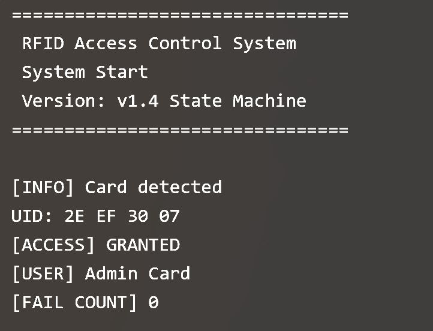
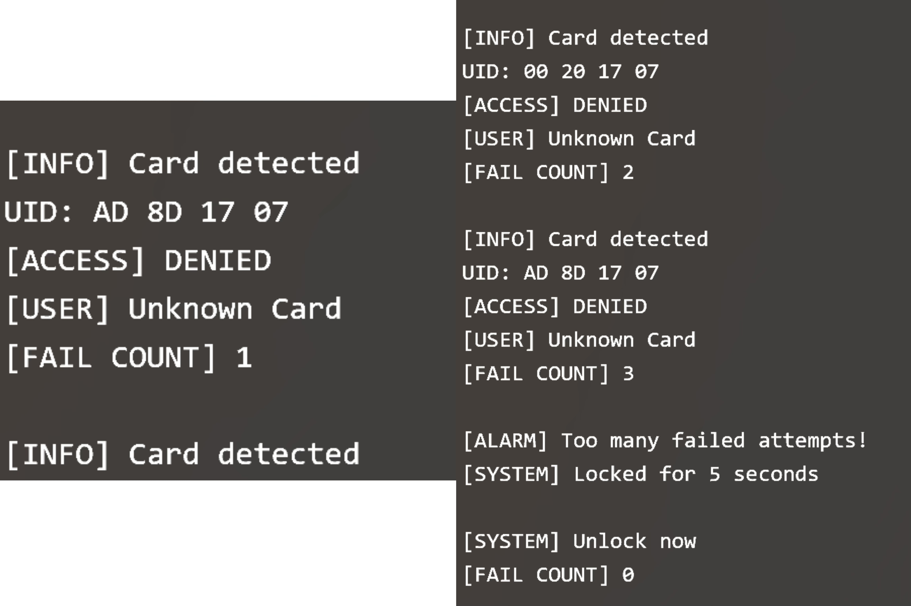
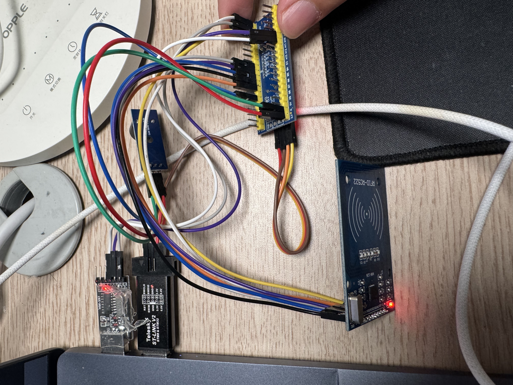

# 🔐 STM32 RFID Access Control System


## 📌 1. Project Overview

This project is an **RFID-based access control system** built with an **STM32F103C8T6 Blue Pill** and an **MFRC522 RFID module**.

The STM32 reads RFID card UIDs through SPI communication, checks whether the card UID exists in the whitelist, and provides access feedback using an LED, buzzer, and USART serial logs.

In version **v2.0**, the system was further upgraded with a **Python-based serial logger**. The STM32 outputs structured access logs through USART, and the Python program reads these logs from the computer serial port and stores them into a local **SQLite database**.

The project supports:

- Multi-card whitelist authentication
- User identity display
- Failed-attempt counting
- Alarm triggering after repeated unauthorized access
- Temporary system lockout
- Modular firmware structure
- State-machine-based main workflow
- Structured serial log output
- Python serial data receiver
- SQLite access log storage
- Local database log viewer

This project demonstrates a complete embedded access control workflow from RFID card detection to authentication, feedback, alarm handling, serial communication, database storage, and local data viewing.

---

## ✨ 2. Features

- ✅ RFID card UID reading using MFRC522
- ✅ SPI communication between STM32F103C8T6 and RC522
- ✅ Multi-card whitelist authentication
- ✅ User identity display through serial logs
- ✅ LED feedback for access result
- ✅ Buzzer feedback for granted / denied access
- ✅ USART1 serial logging at 115200 baud rate
- ✅ Failed-attempt counting
- ✅ Alarm triggered after 3 consecutive unauthorized scans
- ✅ Temporary system lockout for 5 seconds
- ✅ Modular firmware structure
- ✅ State-machine-based main workflow
- ✅ Structured serial log output for computer-side processing
- ✅ Python serial logger for receiving STM32 access logs
- ✅ SQLite database storage for access records
- ✅ Local access log viewer using Python

---

## 🧰 3. Hardware Components

| Component | Description |
|---|---|
| STM32F103C8T6 Blue Pill | Main microcontroller board |
| MFRC522 RFID Module | RFID reader module |
| RFID Card / Tag | RFID access card |
| LED / LED Module | Access result indicator |
| Active-low Buzzer Module | Audio feedback module |
| USB-TTL Module | Serial debugging and Python serial logging |
| ST-Link V2 | Program download and debugging |
| Jumper Wires | Circuit connection |
| Breadboard | Optional prototyping board |

---

## 🔌 4. Wiring

### 4.1 RC522 RFID Module

| RC522 Pin | STM32F103C8T6 Pin | Description |
|---|---|---|
| SDA / CS | PA4 | SPI chip select |
| SCK | PA5 | SPI clock |
| MISO | PA6 | SPI master input |
| MOSI | PA7 | SPI master output |
| RST | PA3 | RC522 reset |
| 3.3V | 3.3V | Power supply |
| GND | GND | Common ground |

> ⚠️ **Note:** The RC522 module should be powered by **3.3V**. Do not connect it to 5V.

---

### 4.2 LED

| LED Pin | STM32F103C8T6 Pin | Description |
|---|---|---|
| Signal / Anode | PA0 | LED control signal |
| GND / Cathode | GND | Common ground |

System behavior:

- Authorized card: LED turns on briefly
- Unauthorized card: LED remains off or turns off

---

### 4.3 Buzzer

| Buzzer Pin | STM32F103C8T6 Pin | Description |
|---|---|---|
| I/O | PA1 | Buzzer control signal |
| VCC | 3.3V | Power supply |
| GND | GND | Common ground |

> The buzzer module used in this project is **active-low**. It turns on when PA1 outputs a low level.

System behavior:

- Authorized card: buzzer beeps once
- Unauthorized card: buzzer beeps three times
- Alarm state: buzzer triggers repeated alarm beeps

---

### 4.4 USART Serial Debugging and Python Logging

| USB-TTL Pin | STM32F103C8T6 Pin | Description |
|---|---|---|
| RXD | PA9 / USART1_TX | Receive serial logs from STM32 |
| GND | GND | Common ground |

The project mainly uses STM32 USART1 TX to send logs to the computer. In v2.0, the same USART output is also used by the Python logger to receive structured access records.

> If serial command input is needed in the future, USB-TTL TXD can be connected to STM32 PA10 / USART1_RX.

---

### 4.5 ST-Link Debugging

| ST-Link V2 Pin | STM32F103C8T6 Pin | Description |
|---|---|---|
| SWDIO | SWDIO | Debug data line |
| SWCLK | SWCLK | Debug clock line |
| GND | GND | Common ground |
| 3.3V | 3.3V | Optional, depending on power source |

---

### 4.6 Wiring Summary

| Function Module | STM32 Pin |
|---|---|
| RC522 SDA / CS | PA4 |
| RC522 SCK | PA5 |
| RC522 MISO | PA6 |
| RC522 MOSI | PA7 |
| RC522 RST | PA3 |
| LED | PA0 |
| Buzzer I/O | PA1 |
| USART1 TX | PA9 |
| USART1 RX | PA10, optional |
| GND | GND |
| Power | 3.3V |

---

## 🖥️ 5. Serial Monitor Settings

| Parameter | Value |
|---|---|
| Port | COM5 |
| Baud Rate | 115200 |
| Data Bits | 8 |
| Parity | None |
| Stop Bits | 1 |
| Flow Control | None |

> In v2.0, the serial assistant should be closed when running the Python logger, because the same COM port cannot be used by two programs at the same time.

---

## 🧾 6. Version History

| Version | Description |
|---|---|
| v1.0 | Basic RFID access control with UID reading, whitelist checking, LED, buzzer, and serial logs |
| v1.1 | Added multi-card whitelist and user identity display |
| v1.2 | Added failed-attempt counting, alarm, and temporary lockout |
| v1.3 | Refactored the code into multiple modules |
| v1.4 | Added a state-machine-based main workflow |
| v1.5 | Added GitHub README, wiring photos, serial output screenshots, and project documentation |
| v2.0 | Added structured serial logging, Python serial receiver, SQLite database storage, and local access log viewer |

---

## 🗂️ 7. Software Architecture

The firmware and Python scripts are organized as follows:

```text
main.c              Main program, state machine, and structured serial log output
rc522.c             RC522 driver and SPI communication
rc522.h
access.c            Whitelist management and access checking
access.h
usart.c             USART1 serial logging
usart.h
led.c               LED control
led.h
buzzer.c            Buzzer control
buzzer.h
delay.c             Software delay
delay.h

serial_logger.py    Python script for reading STM32 serial logs and saving them into SQLite
view_logs.py        Python script for viewing saved access logs from SQLite
access_log.db       SQLite database generated automatically after running serial_logger.py
```

| File | Function |
|---|---|
| main.c | System initialization, state machine loop, and structured LOG output |
| rc522.c / rc522.h | RC522 initialization, register operations, card request, anti-collision, and UID reading |
| access.c / access.h | Whitelist management, UID matching, user name retrieval, repeated-card filtering |
| usart.c / usart.h | USART1 initialization and serial log output |
| led.c / led.h | LED initialization and control |
| buzzer.c / buzzer.h | Buzzer initialization and feedback patterns |
| delay.c / delay.h | Simple software delay |
| serial_logger.py | Reads STM32 LOG messages from COM5 and stores them into SQLite |
| view_logs.py | Reads and prints saved access records from SQLite |
| access_log.db | Local SQLite database generated during runtime |

> `access_log.db` is a generated runtime file. It does not need to be manually created.

---

## 🔁 8. State Machine Design

Starting from version **v1.4**, the main workflow is implemented using a state machine. This structure is kept in version **v2.0**.

| State | Description |
|---|---|
| STATE_IDLE | Waiting for an RFID card |
| STATE_SCAN | Reading the card UID |
| STATE_CHECK | Checking whether the UID exists in the whitelist |
| STATE_GRANTED | Handling authorized access |
| STATE_DENIED | Handling unauthorized access |
| STATE_ALARM | Alarm and temporary system lockout |

Workflow:

```text
IDLE
  ↓ card detected
SCAN
  ↓ UID read successfully
CHECK
  ↓ authorized card        ↓ unauthorized card
GRANTED                    DENIED
  ↓                        ↓ failed count >= 3
IDLE                       ALARM
                           ↓ lockout finished
                           IDLE
```

The state-machine structure makes the main program clearer, easier to debug, and easier to extend in the future.

---

## 🪪 9. Whitelist Management

The whitelist is managed in `access.c`. Each authorized card is stored as a UID and a user name.

Current authorized card:

```text
UID: 2E EF 30 07
Name: Admin Card
```

To add a new authorized card:

1. Scan the new RFID card.
2. Read its UID from the serial monitor.
3. Add the UID and user name into the whitelist in `access.c`.
4. Rebuild and download the program to STM32.

Example:

```c
CardInfo whiteList[] =
{
    {{0x2E, 0xEF, 0x30, 0x07}, "Admin Card"},
    {{0xAD, 0x8D, 0x17, 0x07}, "User Card 1"}
};
```

---

## 📟 10. Serial Output Examples

### 10.1 System Startup

```text
================================
 RFID Access Control System
 System Start
 Version: v2.0 Serial Logging
================================
```

---

### 10.2 Authorized Card

```text
[INFO] Card detected
UID: 2E EF 30 07
[ACCESS] GRANTED
[USER] Admin Card
[FAIL COUNT] 0

LOG,2E EF 30 07,Admin Card,GRANTED,0
```

System behavior:

- LED turns on
- Buzzer beeps once
- Failed count resets to 0
- A structured LOG line is sent to the computer

---

### 10.3 Unauthorized Card

```text
[INFO] Card detected
UID: AD 8D 17 07
[ACCESS] DENIED
[USER] Unknown Card
[FAIL COUNT] 1

LOG,AD 8D 17 07,Unknown Card,DENIED,1
```

System behavior:

- LED remains off
- Buzzer beeps three times
- Failed count increases by 1
- A structured LOG line is sent to the computer

---

### 10.4 Alarm After 3 Failed Attempts

```text
[INFO] Card detected
UID: AD 8D 17 07
[ACCESS] DENIED
[USER] Unknown Card
[FAIL COUNT] 3

LOG,AD 8D 17 07,Unknown Card,DENIED,3

[ALARM] Too many failed attempts!
[SYSTEM] Locked for 5 seconds

LOG,AD 8D 17 07,Unknown Card,ALARM,3

[SYSTEM] Unlock now
[FAIL COUNT] 0
```

System behavior:

- The third unauthorized scan is recorded as `DENIED`
- Alarm is triggered
- The alarm event is recorded as `ALARM`
- System locks for 5 seconds
- Failed count resets after unlock

---

## 🗃️ 11. Python Serial Logger and SQLite Database

In version **v2.0**, the STM32 outputs structured serial logs in the following format:

```text
LOG,UID,USER,RESULT,FAIL_COUNT
```

Examples:

```text
LOG,2E EF 30 07,Admin Card,GRANTED,0
LOG,AD 8D 17 07,Unknown Card,DENIED,1
LOG,AD 8D 17 07,Unknown Card,ALARM,3
```

The Python script `serial_logger.py` reads these structured logs from `COM5` and saves them into a SQLite database named `access_log.db`.

### 11.1 Database Table

The SQLite database contains one table named `access_logs`.

| Field | Description |
|---|---|
| id | Auto-increment record ID |
| timestamp | Access time recorded by the computer |
| uid | RFID card UID |
| user_name | User name from whitelist or Unknown Card |
| result | GRANTED / DENIED / ALARM |
| fail_count | Current failed-attempt count |

### 11.2 Run the Serial Logger

Before running the Python logger, close the serial monitor because the same COM port cannot be opened by two programs at the same time.

Run:

```bash
python serial_logger.py
```

Expected output:

```text
================================
 STM32 RFID Serial Logger
 Listening on: COM5
 Baud rate: 115200
 Database: access_log.db
================================
Waiting for STM32 LOG data...
```

When a card is scanned, the logger displays the serial data and saves the record:

```text
[SERIAL] LOG,AD 8D 17 07,Unknown Card,DENIED,1
[DB] Saved: 2026-05-10 23:30:33, AD 8D 17 07, Unknown Card, DENIED, 1
```

### 11.3 View Saved Logs

Run:

```bash
python view_logs.py
```

Example output:

```text
ID | Timestamp           | UID         | User         | Result  | Fail Count
-------------------------------------------------------------------------------------
3  | 2026-05-10 23:32:59 | 2E EF 30 07 | Admin Card   | GRANTED | 0
2  | 2026-05-10 23:30:33 | AD 8D 17 07 | Unknown Card | DENIED  | 1
1  | 2026-05-10 23:30:14 | 2E EF 30 07 | Admin Card   | GRANTED | 0
```

This confirms that the access records have been successfully stored and retrieved from SQLite.

---

## 🖼️ 12. Demo Images

The following images show the serial output and hardware wiring.

```text
Images/
├── serial_granted.png
├── serial_alarm.png
└── wiring_photo.jpg
```

### Access Granted and Denied Output



### Alarm Output



### Hardware Wiring



---

## ▶️ 13. Demo Behavior

The system works as follows:

1. The system starts and prints startup information through USART.
2. When an authorized card is scanned:
   - The UID is displayed.
   - Access is granted.
   - The user name is displayed.
   - The LED turns on.
   - The buzzer beeps once.
   - A `GRANTED` LOG record is sent to Python.
3. When an unauthorized card is scanned:
   - The UID is displayed.
   - Access is denied.
   - The failed count increases.
   - The buzzer beeps three times.
   - A `DENIED` LOG record is sent to Python.
4. After 3 consecutive unauthorized scans:
   - Alarm is triggered.
   - An `ALARM` LOG record is sent to Python.
   - The system locks for 5 seconds.
   - The system unlocks automatically.
5. Python receives the structured LOG records and stores them into SQLite.

---

## 🚀 14. Project Highlights

This project demonstrates:

- Embedded C programming on STM32
- GPIO control
- SPI communication
- USART serial debugging
- MFRC522 RFID module integration
- RFID UID reading and authentication
- Multi-card whitelist management
- Failed-attempt security logic
- Alarm and temporary lockout mechanism
- Modular firmware design
- State-machine-based system workflow
- Structured serial data output
- Python serial communication using `pyserial`
- SQLite database storage
- Local access log viewing
- Hardware and software debugging ability

---

## 🔮 15. Future Improvements

Possible future upgrades:

- Add OLED display for access result
- Add relay or servo motor to simulate a real door lock
- Add administrator card for whitelist management
- Build a Flask web dashboard for access record visualization
- Add search and filter functions for access logs
- Add statistics such as daily access count and denied access count
- Add ESP8266 / ESP32 WiFi module for IoT access logging
- Upload access logs to a remote backend
- Support remote whitelist management

---

## ✅ 16. Summary

This project implements a complete RFID access control workflow:

```text
Card Detection
→ UID Reading
→ Whitelist Checking
→ Access Feedback
→ Serial Logging
→ Failed-Attempt Alarm
→ State Machine Control
→ Python Serial Logging
→ SQLite Database Storage
→ Local Log Viewing
```

The final system provides a complete embedded access control demo based on STM32 and MFRC522.

It includes RFID reading, whitelist authentication, LED and buzzer feedback, USART logging, failed-attempt alarm, temporary lockout, modular firmware design, state-machine-based control logic, Python serial data collection, SQLite database storage, and local access log viewing.

Version **v2.0** upgrades the project from a standalone embedded access control system into an embedded system with local data logging capability.